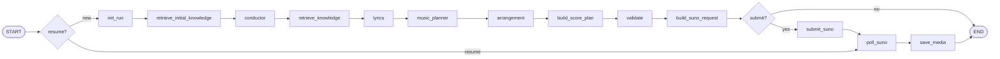
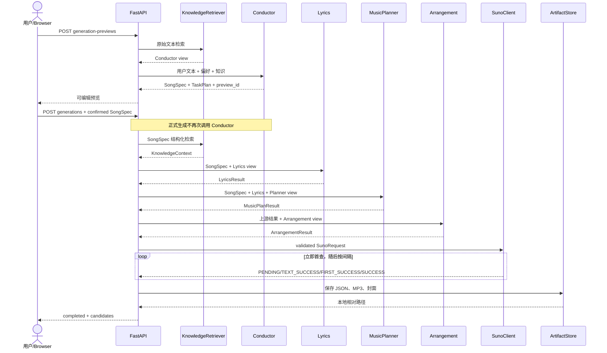

# theNanGuos Agent、Tool、推理与记忆系统

## 1. 文档职责与边界

本文是四个 Agent、确定性 Tool、固定 LangGraph、推理协议、短期状态、长期偏好和创作知识的权威设计。对象字段见 [数据模型](DATA_MODEL.md)，用户可见行为见 [功能规格](../product/SPEC.md)。

Agent 负责结构化创作判断；Tool 和服务负责可验证映射、网络与文件 I/O。任何 Agent 都不能直接写文件、调用 Suno 或动态改变图拓扑。

## 2. 设计目标

- 让每个 Agent 只处理单一专业问题和最小必要上下文。
- LLM 输出必须是可由 Pydantic 验证的最终 JSON。
- 固定图拥有执行顺序，TaskPlan 只解释目标和依赖。
- 用户偏好与客观知识分开维护，均不能从单次任务自动写回。
- 知识失败可降级；LLM/Suno 合同失败必须显式终止。
- 隐藏推理不是产品数据，不进入日志、记忆或下游 prompt。

## 3. 固定 LangGraph

| 节点 | 责任 | 失败策略 |
|---|---|---|
| init_run | 初始化公开状态 | 终止 |
| retrieve_initial_knowledge | 原始文本术语检索 | 通用警告并降级 |
| conductor | 生成或复用 SongSpec/TaskPlan | LLM 重试后终止 |
| retrieve_knowledge | 根据 SongSpec 正式检索 | 通用警告并降级 |
| lyrics/music_planner/arrangement | 生成职责结果 | LLM 重试后终止 |
| build_score_plan | 确定性组合三个结果 | 校验失败终止 |
| validate | 建立验证和脱敏协作日志 | 失败终止 |
| build_suno_request | 确定性映射供应商请求 | 合同失败终止 |
| submit_suno | 远程提交并保存 taskId | 网络/协议规则处理 |
| poll_suno | 观察离散状态直到终态 | 停止、失败、未知、超时分流 |
| save_media | 安全保存候选 MP3/封面 | 保存失败终止 |

图使用 `checkpointer=None`；GraphState 只属于一次 `ainvoke`。

## 4. 四个 Agent

| Agent | 输入 | 输出 | 知识视图 | 禁止行为 |
|---|---|---|---|---|
| ConductorAgent | 用户文本、合并偏好、风格 Markdown | ConductorResult | 风格/乐器定义、听感、边界 | 直接提交 Suno、动态改图、保存偏好 |
| LyricsAgent | SongSpec | LyricsResult | 主题、情绪、语言、叙事；不含 track | 引用曲目歌词、写 API 字段、写文件 |
| MusicPlannerAgent | SongSpec、LyricsResult | MusicPlanResult | 风格节奏/和声/曲式和曲目抽象经验 | 输出逐音符旋律、MIDI、调用外部 API |
| ArrangementAgent | SongSpec、歌词、音乐计划 | ArrangementResult | 风格制作、乐器演奏/角色、曲目配器抽象 | 下载媒体、复刻特定录音、提交 Suno |

### 4.1 Conductor

Conductor 标准化标题、语言、风格、情绪、时长、人声、速度、调性、结构和约束，同时生成解释性 TaskPlan。Web 预览成功后，正式生成复用用户确认的 SongSpec 和预览 TaskPlan，不再次调用 Conductor。

### 4.2 Lyrics

Lyrics 按 SongSpec 结构输出段落和歌词行。纯音乐任务仍由上游约束决定如何构造请求；Lyrics 不自行改变 instrumental。

### 4.3 MusicPlanner

MusicPlanner 为每个段落生成时长、和弦和旋律意图，并给出全局 BPM/Key。旋律意图只描述方向、音域和节奏特征，不是逐音符记谱。

### 4.4 Arrangement

Arrangement 生成全局乐器、混音、动态和 Suno style，并为每个段落提供编曲描述。它不直接生成 SunoRequest。

## 5. 确定性 Tool

| Tool/服务 | 输入 | 输出 | 约束 |
|---|---|---|---|
| score builder/validator | 三个 Agent 结果 | ScorePlan | 段落名称、时长、歌词、和弦和编曲对齐 |
| suno_request_builder | SongSpec、LyricsResult、ArrangementResult、显式设置 | SunoRequest | 模式组合、枚举、长度、权重；不静默截断 |
| SunoClient | SunoRequest/taskId | 任务详情 | 立即首查、离散状态、总超时、有限重试 |
| ArtifactStore | 模型和已记录媒体 URL | JSON/媒体路径 | HTTPS、公网、无重定向、流式、原子替换 |
| PreferenceStore | 显式字段/Markdown | UserProfile/文本 | 进程内锁、原子替换、清除不影响作品 |
| KnowledgeStore/Retriever | Markdown/KnowledgeQuery | Catalog/Context/View | safe_load、路径边界、稳定评分、字符预算 |

## 6. 推理与结构化输出

系统采用 Plan-and-Execute，但不使用自由自治控制：

1. Conductor 产生结构化目标和 TaskPlan。
2. 固定图依次执行专业 Agent。
3. StructuredAgent 将业务 payload 和目标 JSON Schema 发送给 LLM。
4. DeepSeek 使用 JSON Output 和 Thinking Mode。
5. 客户端只解析最终 `content`，再用目标 Pydantic 模型验证。
6. 空内容、截断、非法 JSON 或模型校验失败最多重试两次。

`reasoning_content` 只存在于供应商响应处理边界。它不进入下一 Agent、GraphState 业务字段、CollaborationLog、作品产物、用户偏好、知识库或 API。

## 7. 短期记忆 GraphState

GraphState 是单次图运行的临时共享状态，包含请求、计划、Agent 结果、产物候选、Suno 引用、错误和知识上下文。列表字段使用独立 default_factory，避免请求间共享。

MVP 不连接 checkpointer。服务器重启后：

- GraphState 丢失；
- 原 asyncio.Task 不恢复；
- CollaborationLog 和 taskId 仍可用于新轮询；
- UI 必须显示 service_restarted/interrupted，而不是 running。

字段见 [DM-GraphState](DATA_MODEL.md#dm-graphstate)。

## 8. 用户长期偏好

长期偏好由两个文件组成：

- `user_profile.json`：language、instrumental、vocal_gender、suno_model；
- `style_preferences.md`：用户主动编辑的自由风格说明。

合并优先级：本次自然语言明确要求 > Web/CLI 显式字段 > UserProfile > 系统默认。单次任务不自动修改任何长期偏好。结果页只能保存用户勾选的确认字段。

## 9. 创作知识库

知识源是人工维护的 Markdown：

- `knowledge/styles/*.md`：定义、听感、节奏、和声、乐器、制作边界和描述词；
- `knowledge/instruments/*.md`：音色、角色、演奏、编配、搭配和制作；
- `knowledge/tracks/*.md`：元数据、风格判断、曲式、配器、制作分析和抽象经验。

每个文件必须有严格 YAML frontmatter、HTTP(S) 来源和复核日期。ID 全库唯一，type 与目录一致，交叉引用必须闭合。根、分类目录和文件的符号链接均拒绝。

经典曲目不得包含歌词、音频、逐音符旋律或直接模仿指令。人工知识是创作参考，不是用户偏好，也不由 Agent 更新。

## 10. 两阶段检索与职责视图

### 10.1 初始检索

加载单次目录快照后，使用原始用户文本匹配名称、别名、标签、引用和正文术语。结果只向 Conductor 提供定义和边界，用于理解诸如 City Pop、Rhodes 等术语。

### 10.2 正式检索

SongSpec 形成后，以原始文本、genre、mood、structure、vocal 和明确 instruments 查询。固定评分为：ID/名称 10、别名 8、引用 4、每个标签 3、正文命中总计最高 5；同分按 ID 排序，受 Top-K、类型配额和字符预算限制。

### 10.3 角色隔离

Retriever 按章节白名单重新构造 AgentKnowledgeView。Lyrics 不获得 track；Conductor 不获得 track；MusicPlanner 和 Arrangement 只获得曲目中的抽象结构/配器/制作章节。引用 URL 和整篇 Markdown 不进入 Agent payload。

## 11. 生成时序图

恢复查询从 API 直接进入 SunoClient poll，不执行 K/C/L/M/A，也不重新 submit。

## 12. 降级、日志和安全

- KnowledgeStore/retrieve/view 的未知异常转为通用 code/message，不把异常路径和内容写日志。
- CollaborationLog.knowledge 只保存 used、catalog_indexed_at、KnowledgeReference 和 warnings。
- KnowledgeReference 只含 id、type、score、相对 source_path；禁止 absolute 和 `..`。
- Agent payload 只在进程中发送给 LLM，不作为协作日志。
- LLM 错误可以终止任务；知识错误不能阻断基础生成。
- Suno 失败和媒体失败由服务层记录，不交给 Agent 自由判断。

## 13. 测试合同

- StructuredAgent：payload、目标 schema、正常/空/非法/截断/校验失败。
- Graph：固定节点、resume 入口、offline 分支、状态隔离。
- 知识：Schema、safe_load、引用、缓存、稳定评分、预算、角色隔离、降级、日志脱敏、符号链接。
- 集成：原始查询在 Conductor 前，结构化查询在 SongSpec 后；四个 Agent 收到正确 view。
- 安全：reasoning_content、Markdown 正文、excerpt、绝对路径和密钥不进入日志/API。
