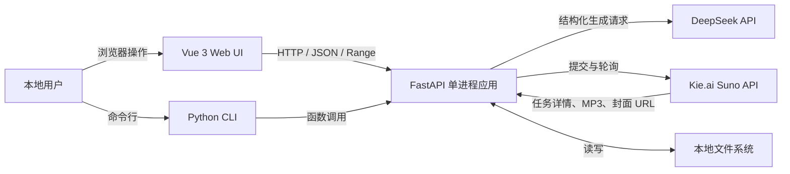
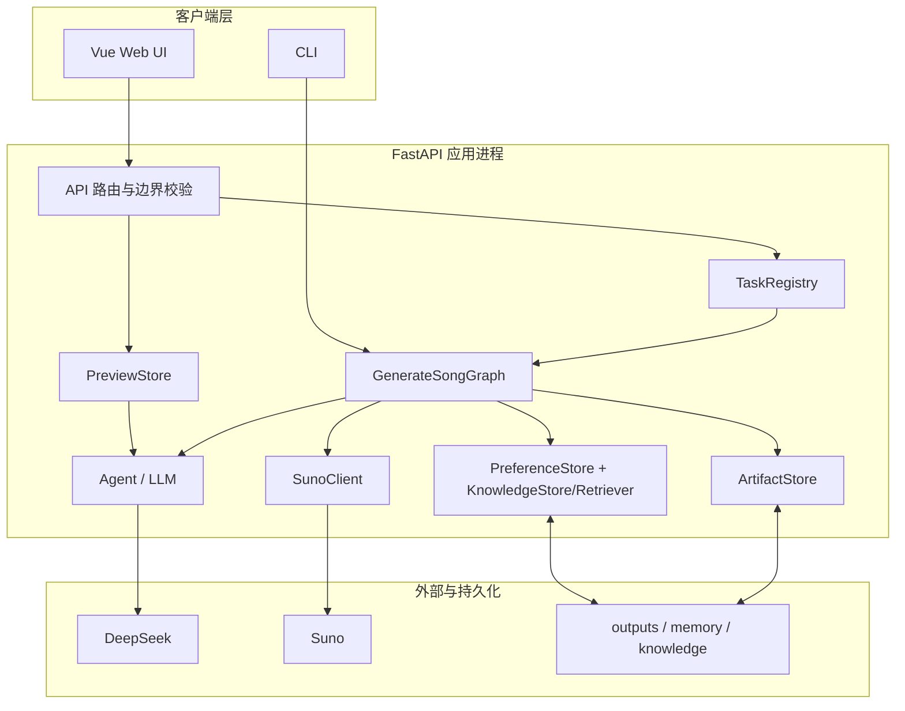

# theNanGuos 系统架构

## 1. 文档职责与架构目标

本文定义系统边界、组件职责、进程与部署模型、技术选型和非功能约束。Agent/Tool/记忆内部机制见 [Agent 系统](AGENT_SYSTEM.md)，对象字段见 [数据模型](DATA_MODEL.md)，HTTP 与供应商协议见 [API 合同](API_SPEC.md)。

架构目标：

- 本地单用户环境中形成可运行、可测试的音乐生成闭环；
- LLM、编排、确定性业务规则和供应商协议分层；
- 长耗时 Suno 任务不阻塞创建请求或依赖浏览器页面存活；
- 媒体和作品优先使用本地文件，避免供应商 URL 到期；
- 密钥、隐藏推理和不可信网络内容不进入前端或产物；
- MVP 保持单进程、文件存储和确定性检索，不提前引入分布式复杂度。

## 2. 系统上下文



| 参与者 | 职责 | 信任边界 |
|---|---|---|
| 本地用户 | 输入创作描述、确认方案、管理作品和偏好 | 用户 Markdown 仍按不可信展示内容处理 |
| Vue Web UI | 展示状态、播放本地媒体、发送显式操作 | 不接触 API key、GraphState 和供应商原始 JSON |
| Python CLI | 提供离线/提交入口 | 与 Web 复用服务层，不复制业务规则 |
| FastAPI 应用 | 校验输入、管理任务、运行图、保存产物、提供媒体 | 默认只监听 127.0.0.1；单进程内存状态不跨重启 |
| DeepSeek | 生成结构化创作结果 | 输出必须解析和 Pydantic 校验；隐藏推理不落盘 |
| Suno | 执行远程音乐生成 | 状态、URL 和媒体均视为外部输入并校验 |
| 本地文件系统 | 保存偏好、知识源、产物和媒体 | 路径由服务端元数据构造，拒绝用户路径拼接 |

## 3. 总体架构与分层



| 组件 | 输入 | 输出 | 主要依赖 |
|---|---|---|---|
| API 路由 | 浏览器请求 | UI 视图、媒体响应、错误响应 | PreviewStore、TaskRegistry、PreferenceStore、ArtifactStore |
| PreviewStore | ConductorResult | 30 分钟一次性 preview_id | 进程内锁与时间戳 |
| TaskRegistry | GenerationRecord、runner | 后台 asyncio.Task、公开任务状态、安全整任务删除 | outputs 重建索引、ArtifactStore |
| GenerateSongGraph | GraphState 和节点函数 | 结构化产物、Suno 结果、本地媒体 | Agent、Context、SunoClient、ArtifactStore |
| Agent/LLM | 职责最小化结构化输入 | Pydantic 模型 | DeepSeek 适配器 |
| PreferenceStore | JSON/Markdown | 用户确认型默认值和风格文本 | 原子文件替换、进程内锁 |
| KnowledgeStore/Retriever | Markdown 和查询 | Catalog、Context、职责视图 | PyYAML、确定性评分 |
| SunoClient | 已校验 SunoRequest | taskId、轮询详情 | httpx、总截止时间 |
| ArtifactStore | 模型和安全媒体 URL | JSON、MP3、封面 | pathlib、流式 HTTP、原子替换 |

## 4. 技术选型与理由

| 需求 | 选择 | 理由 | MVP 暂不选择 |
|---|---|---|---|
| Web 前端 | Vue 3 + TypeScript + Vite | 组件与响应式状态清晰，构建快，适合五页本地应用 | React 重写、桌面原生框架 |
| 路由与状态 | Vue Router + Pinia | 官方生态、类型清楚、播放器和生成状态可共享 | 自建事件总线 |
| HTTP 后端 | FastAPI | Pydantic 集成、异步 HTTP/文件响应、OpenAPI 边界清楚 | Flask 同步胶水、Django 全栈重量 |
| Agent 编排 | LangGraph 固定图 | GraphState 和条件边清晰，可测试且不让 LLM 动态改写控制流 | 自建工作流、自由自治 Agent |
| 数据校验 | Pydantic | LLM、API、Suno 和产物在边界统一校验 | 无类型 dict、手写散落校验 |
| 外部 HTTP | httpx | 异步、流式下载、超时与测试注入能力 | requests 阻塞调用 |
| 用户风格与知识 | Markdown + YAML | 人工可读、可审查、适合长文本和元数据 | 数据库后台、CMS |
| 知识检索 | 确定性关键词/别名评分 | 当前规模可解释、稳定、无需运行基础设施 | 向量数据库、embedding 服务 |
| Python 依赖 | uv | 锁文件和 Python 3.11 环境可复现 | 同时维护多个包管理器 |
| 测试 | pytest + Vitest + Playwright | 分别覆盖后端合同、前端逻辑和真实浏览器闭环 | 只依赖人工点击 |
| 运行模型 | 单 FastAPI 进程 + asyncio.Task | 本地单用户足够，浏览器离开后任务继续 | Celery、Redis、分布式队列 |
| 持久化 | 本地 JSON/Markdown/媒体文件 | 数据量小、可直接检查、无需迁移服务 | SQL 数据库、对象存储 |

MVP 不使用 checkpointer 恢复 LangGraph。服务重启后只根据协作日志重建任务视图，并利用已保存 taskId 新建轮询，不伪装恢复原执行栈。

## 5. 工程结构与模块职责

```text
pyproject.toml                 Python 项目、依赖和测试配置
the_nanguos/
├─ __main__.py                Python 模块入口
├─ cli.py                     CLI 参数与 FastAPI 启动命令
├─ api/
│  └─ app.py                  HTTP 路由、请求校验、CORS、Range 与下载
├─ agents/
│  ├─ _base.py                结构化 Agent 公共调用边界
│  ├─ conductor.py            SongSpec 与 TaskPlan
│  ├─ lyrics.py               分段歌词
│  ├─ music_planner.py        BPM、Key、曲式、和弦与旋律意图
│  └─ arrangement.py          配器、制作与 Suno style
├─ graphs/
│  ├─ state.py                单次运行 GraphState
│  └─ generate_song.py        固定图拓扑与条件边
├─ knowledge/
│  ├─ models.py               知识元数据、查询、上下文和引用模型
│  ├─ store.py                Markdown 加载、校验、缓存与路径边界
│  └─ retriever.py            确定性检索和 Agent 职责视图
├─ llm/
│  └─ client.py               供应商无关接口与 DeepSeek 适配器
├─ memory/
│  └─ preferences.py          JSON/Markdown 偏好原子存储与合并
├─ schemas/
│  └─ models.py               领域对象、Suno 协议和协作日志
├─ services/
│  ├─ generation.py           LangGraph 节点实现和生成编排
│  ├─ jobs.py                 TaskRegistry、后台任务和启动索引
│  ├─ runtime.py              由环境变量装配运行时依赖
│  ├─ storage.py              JSON 产物、安全媒体下载与本地定位
│  └─ suno.py                 提交、详情和轮询客户端
└─ tools/
   └─ suno_request_builder.py 确定性 Suno 字段映射
frontend/
├─ src/
│  ├─ api/                    UI API client 和视图类型
│  ├─ components/             应用壳、播放器与通用组件
│  ├─ data/                   显式视觉 demo 数据
│  ├─ pages/                  创作、等待、结果、作品和偏好页
│  ├─ stores/                 生成、播放器与偏好状态
│  └─ styles/                 设计 token 和页面样式
└─ e2e/                       Playwright Mock 全栈流程
tests/                        后端确定性、API、知识与文档合同测试
outputs/                      每次请求的 JSON、MP3 和封面
memory/                       本地用户确认型偏好
knowledge/                    版本化风格、乐器和曲目知识源
docs/                         正式产品、架构、合同、计划和 WU
```

| 模块 | 单一职责 | 不负责 |
|---|---|---|
| api | HTTP 边界和 UI 视图 | LLM prompt、Suno 业务规则 |
| agents | 结构化专业创作 | 写文件、调用 Suno、控制图拓扑 |
| graphs | 固定执行顺序和状态传递 | 字段级供应商实现 |
| knowledge | 人工知识读取、校验、检索 | 用户偏好、自动学习、创作写回 |
| llm | 供应商协议适配 | 产品流程和持久化 |
| memory | 用户确认偏好 | 单次 GraphState、知识事实 |
| schemas | 边界模型与验证 | I/O 和业务编排 |
| services | 用例编排、任务、网络和存储服务 | 页面表现 |
| tools | 纯确定性映射 | 自由文本创作 |

## 6. 入口与进程模型

### Web 入口

FastAPI lifespan 创建单例 PreviewStore、TaskRegistry、PreferenceStore、ArtifactStore 和环境驱动 runner。创建接口只登记后台任务；请求返回后 asyncio.Task 在当前进程继续。Vite 开发服务器代理 `/api`，生产构建可由独立静态服务器托管。

### CLI 入口

`python -m the_nanguos` 解析自然语言和参数后调用同一 GenerationService。`--api` 启动 Web 后端；`--no-submit` 在生成 SunoRequest 和四个 JSON 产物后结束。

### 进程约束

- 默认监听 `127.0.0.1`。
- 单进程内存注册表不用于跨进程一致性。
- 浏览器关闭不影响已创建 asyncio.Task；服务进程结束会取消本地任务。
- CLI 和 FastAPI 模块启动时从当前目录向上查找最近的 `.env`；加载使用 `override=False`，显式进程环境始终优先。密钥加载后只存在于进程环境，不进入业务产物或日志。

## 7. 后台任务与生命周期

TaskRegistry 保存 `GenerationRecord` 与 `asyncio.Task`。状态写入 record，面向 UI 的 public 视图只公开白名单设置、阶段事件、候选和结构化错误。

服务启动时扫描 `outputs/*/collaboration_log.json`：

- Suno SUCCESS → completed；
- PENDING/TEXT_SUCCESS/FIRST_SUCCESS → interrupted/service_restarted；
- STOPPED_WAITING → stopped；
- 其他终态 → failed。

继续查询要求 taskId 和保存日志，创建新的本地轮询任务。它不重新执行 Conductor/Agent，也不重复提交 Suno。

## 8. 关键运行路径

### 8.1 预览

API → 偏好合并 → 初始知识检索 → Conductor → PreviewStore → 浏览器确认。

### 8.2 新生成

消费预览 → TaskRegistry → GraphState → 正式知识检索 → 三个 Agent → ScorePlan → SunoRequest → 提交 → 轮询 → 完整候选校验 → 按本地 retention_limit 截取 → 媒体保存 → completed。retention_limit 不进入 GraphState 创作偏好或供应商请求。

### 8.3 恢复查询

作品页 → resume API → 已保存 CollaborationLog/taskId → 轮询 → 媒体保存。该路径跳过 LLM、知识和 Suno 提交。

## 9. 本地存储

- `outputs/<request_id>/`：四个 JSON、audio、covers。
- `memory/user_profile.json`：确认型默认字段。
- `memory/style_preferences.md`：用户编辑风格文本。
- `knowledge/**/*.md`：人工知识事实源。
- `knowledge/_index/catalog.json`：可删除重建缓存。

偏好、索引和媒体采用临时文件加原子替换。媒体流式写入且限制大小；业务路径不得接受用户提供的任意文件路径。整任务删除只允许 TaskRegistry 已登记的 outputs 直属目录，拒绝符号链接，并在文件删除成功后移除内存记录。

## 10. 安全与可靠性

- 密钥不进入源文件、日志、API 或错误详情。
- DeepSeek `reasoning_content` 不进入 prompt 链、记忆、产物或前端。
- 供应商响应必须结构化校验，未知状态显式失败。
- 媒体 URL 必须 HTTPS、在任务记录中、解析为公网地址且禁止重定向。
- request_id/audio_id 只作为元数据键，不直接拼接任意路径。
- 知识目录和条目拒绝符号链接、绝对路径和 `..`。
- 用户 Markdown 不执行原始 HTML 和事件处理器。
- DNS 解析与实际连接之间仍存在理论上的 rebinding TOCTOU 风险；MVP 通过预解析、公网限制、禁止重定向和来源白名单降低风险。

## 11. 错误处理

错误在边界转为结构化 code/message；前端不接收内部堆栈。LLM、知识、Suno 和媒体错误区分处理：

- LLM 结构失败：有限重试后终止；
- 知识失败：通用警告并降级；
- Suno 业务失败：不重试；网络/429/5xx：总期限内有限重试；
- 媒体失败：停止完成流程并保存错误；
- 损坏历史日志：启动索引跳过，不阻塞服务。

## 12. 测试架构

- pytest：Schema、Agent、Graph、偏好、知识、Suno、媒体、任务和 API。
- Vitest：前端 API 映射、状态、播放器和页面行为。
- Playwright：真实 Vite + FastAPI、Mock 供应商的浏览器闭环。
- 视觉 QA：1440×1024 与五张原型逐页比较。
- 真实联调：DeepSeek 和 Suno 分开执行并检查脱敏日志。

Mock、视觉和真实供应商证据在 [STATUS](../planning/STATUS.md) 分开记录。

## 13. 扩展边界

未来只有在明确需求出现时才考虑数据库、队列、多进程、checkpointer、向量检索、多用户、认证和公网部署。扩展必须保持 LLMClient、KnowledgeRetriever、SunoClient 与业务编排的接口边界，不能把供应商假设扩散到 Agent 或 UI。
