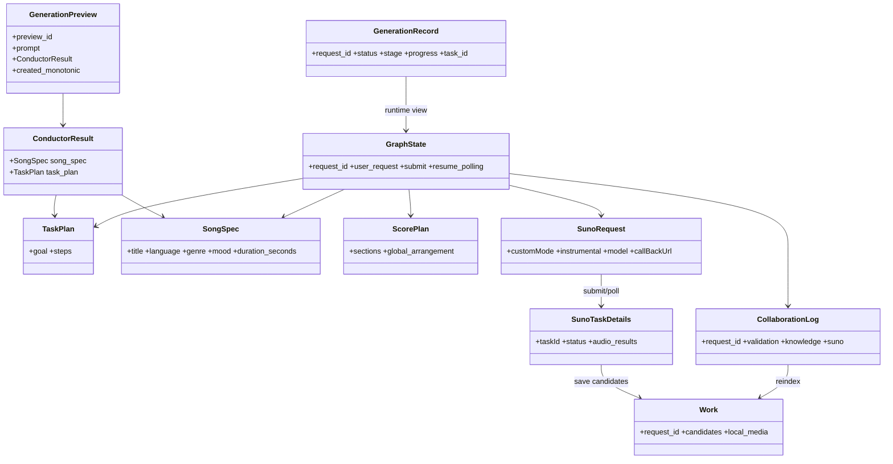

# theNanGuos 数据模型与字段合同

## 1. 文档职责

本文是领域对象、字段、枚举、约束、JSON 名称和文件映射的权威来源。用户行为见 [功能规格](../product/SPEC.md)，传输与状态码见 [API 合同](API_SPEC.md)。字段以当前 Pydantic/dataclass 实现为“已实现”证据。

## 2. 核心对象 UML



`GenerationPreview` 和 `Work` 是协议/UI 视图，不是独立 Pydantic 类；其组成由 API、ConductorResult、GenerationRecord 和日志决定。

## 3. 公共约束

- 领域与协议模型默认 `extra="forbid"`。
- API 边界使用 Pydantic 验证；内部 GraphState 允许 Path 等任意类型。
- 可变列表和字典使用 default_factory。
- JSON 对外采用协议要求的 camelCase；Python 内部主要使用 snake_case 和 alias。
- URL 使用 AnyHttpUrl，并在媒体模型额外要求 HTTPS。
- 枚举和值域不得由 UI 自由发明。

## 4. 创作规划模型

### DM-TaskPlan

| 字段 | 类型 | 约束 |
|---|---|---|
| goal | string | 非空 |
| steps | TaskStep[] | 至少一项 |

TaskStep：id 符合小写标识模式且全局唯一；actor 只能是四个 Agent；task/output_key 非空；input_keys/depends_on 为字符串数组；依赖必须存在且无环。TaskPlan 不拥有图拓扑。

### DM-SongSpec

| 字段 | 类型 | 约束/默认 |
|---|---|---|
| title | string | 1–100 |
| language | string | 2–16 |
| genre | string | 1–120 |
| mood | string[] | 至少一项 |
| duration_seconds | integer | 30–600 |
| vocal | VocalSpec | enabled=true；gender=male/female/null |
| tempo | TempoSpec | bpm 40–240，默认 90；feel 默认 steady |
| key | string | 默认 C major |
| structure | string[] | 至少一项 |
| constraints | SongConstraints | explicit=false；avoid=[] |

### DM-LyricsResult

`sections` 至少一项；每项 name 非空，lines 为字符串数组。

### DM-MusicPlanResult

全局 bpm 40–240、key 非空。每个 section 包含 name、1–600 秒 duration_seconds、chords[] 和非空 melody_intent。

### DM-ArrangementResult

instruments 至少一项；mix_style、dynamic_curve、suno_style 非空；每个 section 包含 name 和非空 arrangement。

### DM-ScorePlan

`sections` 至少一项。ScoreSection 含 name、duration_seconds、lyrics、chords、melody_intent、arrangement；global_arrangement 含 instruments、mix_style、dynamic_curve、suno_style。

## 5. 运行状态模型

### DM-GenerationPreview

协议视图：`preview_id` 是 32 位小写十六进制；保存原 prompt、ConductorResult 和单调时钟创建时间。只存在 FastAPI 进程内，30 分钟后无效，消费时先移除。

### DM-GraphState

| 类别 | 字段 |
|---|---|
| 请求 | request_id、user_request、submit、resume_polling、output_dir |
| 规划 | task_plan、song_spec、lyrics_result、music_plan_result、arrangement_result、score_plan |
| 供应商 | suno_request、suno_task_id、suno_result、polling_stopped |
| 诊断 | validation_result、errors、collaboration_log |
| 知识 | initial_knowledge_context、knowledge_context、knowledge_warnings |

除 user_request 外大多数字段可空，以适应固定图逐节点填充。该模型不接 checkpointer。

### DM-GenerationRecord

dataclass 字段：request_id、user_request、status、stage、progress、task_id、error、candidates、stage_events、options、retention_limit、approved_song_spec、approved_task_plan、created_at、updated_at、stop_event。retention_limit 为 1、2 或 null，新任务默认 1；旧日志缺失该字段时重建为 null 以保持历史候选。

公开视图只包含 request_id、user_request、status、stage、progress、task_id、error、candidates、白名单 settings、retention_limit、stage_events、created_at、updated_at。approved 结果和 stop_event 不公开。

### DM-CollaborationLog

| 字段 | 类型 | 说明 |
|---|---|---|
| request_id | string | 本地任务键 |
| user_request_summary | string | 用户请求摘要 |
| artifacts | map[string,string] | 相对产物名 |
| steps | CollaborationStep[] | actor/action/output |
| validation | ValidationLog | passed + warnings |
| knowledge | KnowledgeLog | 引用和通用警告，不含正文 |
| suno | SunoLog | 提交、轮询、候选、媒体和错误 |

SunoLog：submitted、task_id、status、audio_results、provider_candidate_count、retention_limit、retained_candidate_count、error、poll_interval_seconds、max_wait_seconds、attempts、elapsed_seconds、last_status、local_media。audio_results/local_media 只保存被保留候选；三个计数字段用于审计本地裁剪。

## 6. 供应商协议模型

### DM-SunoRequest

| JSON | Python | 类型/约束 |
|---|---|---|
| customMode | custom_mode | boolean，必填 |
| instrumental | instrumental | boolean，必填 |
| model | model | SunoModel，必填 |
| callBackUrl | callback_url | URL，必填 |
| prompt | prompt | string/null，按模式和模型限长 |
| style | style | string/null，customMode 使用 |
| title | title | string/null，customMode 使用 |
| negativeTags | negative_tags | string/null |
| vocalGender | vocal_gender | m/f/null |
| styleWeight | style_weight | 0–1/null |
| weirdnessConstraint | weirdness_constraint | 0–1/null |
| audioWeight | audio_weight | 0–1/null |

SunoModel 已实现：V4、V4_5、V4_5PLUS、V4_5ALL、V5、V5_5。非 custom 模式只允许 prompt 作为创作字段。长度和组合见 [API-SUNO-GEN-001](API_SPEC.md#api-suno-gen-001)。

### DM-SunoTaskDetails

字段：task_id（alias taskId）、status、audio_results、error。模型在验证前把供应商 `response.sunoData` 展平到 audio_results。

### DM-SunoAudio

| JSON | Python | 约束 |
|---|---|---|
| id | id | string |
| audioUrl | audio_url | HTTPS 必填 |
| streamAudioUrl | stream_audio_url | HTTPS/null |
| imageUrl | image_url | HTTPS/null |
| sourceAudioUrl | source_audio_url | HTTPS/null；Kie 原始音频地址 |
| sourceStreamAudioUrl | source_stream_audio_url | HTTPS/null；Kie 原始流地址 |
| sourceImageUrl | source_image_url | HTTPS/null；Kie 原始封面地址 |
| prompt | prompt | string/null；日志/前端不必公开 |
| modelName | model_name | string/null |
| title | title | string |
| tags | tags | string/null |
| createTime | create_time | ISO string/null；供应商 epoch 毫秒整数在边界转换为 UTC ISO 字符串 |
| duration | duration | 非负 number/null |

进行中状态的 `sunoData` 允许字段不完整，不构造 DM-SunoAudio；只有终态完整候选进入该模型。六类媒体 URL 在持久化协作日志前统一删除 query。

## 7. 用户偏好模型

UserProfile：schema_version 固定 1；language 可空；instrumental 可空；vocal_gender 为 m/f/null；suno_model 为 SunoModel/null。

StylePreferences 当前是 UTF-8 Markdown 文本，不是 Pydantic 对象。最大 HTTP 输入 100000 字符；保存采用临时文件和原子替换。

合并后值不写回 UserProfile，除非用户显式保存。

## 8. 知识模型

### DM-KnowledgeDocument

由严格 frontmatter、非空 body、解析后的 sections 和相对 source_path 构成。公共 frontmatter：id、type、name、aliases、tags、related_styles、related_instruments、reference_tracks、sources、updated_at。

- id 格式为 `style|instrument|track.<slug>` 且前缀匹配 type；
- aliases/tags 至少一项、去空白且大小写不重复；
- sources 至少一个 HTTP(S) URL；
- Track 额外要求 artist、year、style_refs。

### DM-KnowledgeCatalog

schema_version=1、indexed_at、fingerprint、documents、warnings。索引是派生缓存，Markdown 是事实源。

### DM-KnowledgeContext

字段：catalog_indexed_at、entries、warnings。KnowledgeEntry：id、type、非负 score、excerpt、相对 source_path。Context 只在本次图中使用。

KnowledgeReference 从 Entry 删除 excerpt 后形成，只保存 id、type、score、相对 source_path。

AgentKnowledgeView：agent 只能是四个 Agent 名称，entries 和 warnings 已按职责过滤。

## 9. 请求与视图模型

GenerationOverrides：language 2–16、instrumental、vocal_gender m/f、suno_model、title 1–100、custom_mode、negative_tags 最长 1000、三个权重 0–1 且步长 0.01。

CreateGeneration：prompt 1–10000、overrides、save_defaults 白名单、preview_id、approved_song_spec、顶层 retention_limit。retention_limit 严格接受 1、2、null，默认 1；preview_id 和 approved_song_spec 必须同时存在或同时缺失。

StylePayload：markdown 最长 100000。

GenerationPreview 响应：preview_id、SongSpec、TaskPlan。Generation 创建响应：request_id、status。列表响应：items 为 GenerationRecord.public 视图。

## 10. 产物与本地作品

```text
outputs/<request_id>/
├─ song_spec.json              DM-SongSpec
├─ score_plan.json             DM-ScorePlan
├─ suno_request.json           DM-SunoRequest，使用 alias
├─ collaboration_log.json      DM-CollaborationLog
├─ audio/<audio_id>.mp3
└─ covers/<audio_id>.<ext>
```

### 本地作品视图

协议/UI 视图 candidate 字段：audio_id、title、duration、audio_url、download_url、cover_url、model_name、tags、create_time。URL 指向本地 API，不保存为领域实体。

local_media 日志条目当前是字符串字典，至少包含 audio_id、脱敏 source_url、相对 audio_path，存在封面时包含 cover_path。

## 11. JSON 示例

完整示例只在本节维护：

```json
{
  "title": "Night Study",
  "language": "zh",
  "genre": "lo-fi pop",
  "mood": ["warm", "focused"],
  "duration_seconds": 90,
  "vocal": {"enabled": true, "gender": "female"},
  "tempo": {"bpm": 78, "feel": "laid-back"},
  "key": "C major",
  "structure": ["intro", "verse", "chorus", "outro"],
  "constraints": {"explicit": false, "avoid": ["harsh vocal"]}
}
```

```json
{
  "customMode": true,
  "instrumental": false,
  "model": "V5",
  "callBackUrl": "https://example.com/callback",
  "prompt": "[Verse]\n夜色落在书页旁",
  "style": "Chinese lo-fi pop, warm soft female vocal",
  "title": "Night Study",
  "vocalGender": "f"
}
```

## 12. 兼容性与演进

- UserProfile 和 KnowledgeCatalog 有 schema_version；变更需要向后读取或显式迁移。
- CollaborationLog 新增字段必须提供默认值，以读取旧作品日志。
- 外部供应商字段变化先更新 API adapter 和模型测试，再更新本文/API_SPEC。
- UI 视图可增添可选字段，但不能暴露内部 GraphState、密钥或隐藏推理。
