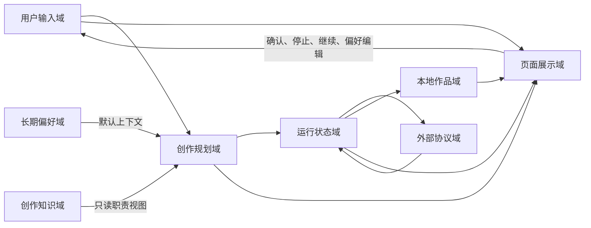

# theNanGuos 信息架构

## 1. 文档职责

本文定义信息域、拥有者、读写方向、生命周期和跨域关系。字段级定义统一见 [数据模型](DATA_MODEL.md)，接口传输见 [API 合同](API_SPEC.md)，产品含义见 [PRD](../product/PRD.md)。

## 2. 信息域关系图



| 来源域 | 目标域 | 关系 | 禁止的反向写入 |
|---|---|---|---|
| 用户输入 | 创作规划 | 自然语言和显式覆盖形成创作意图 | 规划结果不自动成为长期偏好 |
| 长期偏好 | 创作规划 | 提供低优先级默认值和风格上下文 | 单次生成不自动更新偏好 |
| 创作知识 | 创作规划 | 提供人工事实和抽象经验 | Agent 不写回知识源 |
| 创作规划 | 运行状态 | Agent 结果进入单次 GraphState | 运行错误不污染知识和偏好 |
| 运行状态 | 外部协议 | 生成已校验请求并观察远程状态 | 原始供应商 JSON 不直接返回 UI |
| 运行状态 | 本地作品 | 保存产物、日志和媒体 | 作品文件不反向改写创作计划 |
| 各业务域 | 页面展示 | 映射为用户可理解视图 | UI 不直接编辑内部状态和协议对象 |

## 3. 用户输入域

| 项目 | 内容 |
|---|---|
| 目的 | 表达本次创作意图和用户主动操作 |
| 核心对象 | UserNaturalLanguage、GenerationOverrides、ApprovedSongSpec、偏好编辑命令 |
| 写入方 | 用户、Web UI、CLI |
| 读取方 | Preview API、Generation API、PreferenceStore |
| 生命周期 | 自然语言跨预览保留；显式参数只作用本次，除非用户确认保存 |
| 持久化 | 任务摘要进入协作日志；完整输入不自动进入长期偏好 |
| 字段权威 | [请求与视图模型](DATA_MODEL.md#请求与视图模型) |

信息优先级：本次自然语言明确要求 > Web/CLI 显式字段 > 长期偏好 > 系统默认。自然语言与显式字段冲突时 Conductor 必须遵循该顺序并输出一致 SongSpec。

## 4. 创作规划域

| 项目 | 内容 |
|---|---|
| 目的 | 把模糊需求转换为可验证、可组合的创作结果 |
| 核心对象 | TaskPlan、SongSpec、LyricsResult、MusicPlanResult、ArrangementResult、ScorePlan |
| 写入方 | 四个 Agent、用户方案确认、生成服务 |
| 读取方 | 下游 Agent、score builder、Suno builder、产物存储 |
| 生命周期 | 预览中的 SongSpec/TaskPlan 临时存在；正式结果随任务产物长期保存 |
| 持久化 | SongSpec、ScorePlan 为作品 JSON；中间 Agent 对象主要存在 GraphState |
| 字段权威 | [创作规划模型](DATA_MODEL.md#创作规划模型) |

TaskPlan 解释固定图中的目标和依赖，不拥有执行拓扑。用户可以编辑产品允许的 SongSpec 字段，不能编辑内部 TaskPlan 或 GraphState。

## 5. 运行状态域

| 项目 | 内容 |
|---|---|
| 目的 | 管理单次请求、后台任务、阶段事件、错误和远程任务引用 |
| 核心对象 | GenerationPreview、GraphState、GenerationRecord、CollaborationLog |
| 写入方 | PreviewStore、TaskRegistry、LangGraph 节点、Suno 轮询器 |
| 读取方 | API、等待/结果/作品页、启动重建索引 |
| 生命周期 | Preview 30 分钟一次消费；GraphState 单次运行；Record 当前进程；Log 长期 |
| 持久化 | collaboration_log.json；进程内 Preview/Record 不做通用恢复 |
| 字段权威 | [运行状态模型](DATA_MODEL.md#运行状态模型) |

### 5.1 生命周期

```text
UserNaturalLanguage
  → GenerationPreview（进程内、30 分钟、一次消费）
  → SongSpec + TaskPlan（用户确认）
  → GenerationRecord（当前服务进程公开状态）
  → GraphState（单次 LangGraph 状态）
  → CollaborationLog（脱敏、长期）
```

服务重启后只从 CollaborationLog 重建 UI 记录；不重建原 GraphState 或 asyncio.Task。

## 6. 长期偏好域

| 项目 | 内容 |
|---|---|
| 目的 | 保存用户主动确认的默认设置和长期风格说明 |
| 核心对象 | UserProfile、StylePreferences |
| 写入方 | 偏好页、结果页的主动保存操作 |
| 读取方 | Preview/Generation 合并逻辑、Conductor |
| 生命周期 | 跨任务、跨服务重启，直到用户修改或清除 |
| 持久化 | `memory/user_profile.json`、`memory/style_preferences.md` |
| 字段权威 | [用户偏好模型](DATA_MODEL.md#用户偏好模型) |

JSON 与 Markdown 是两类信息：JSON 用于确认型参数，Markdown 用于自由风格描述。清除偏好不删除作品。

## 7. 创作知识域

| 项目 | 内容 |
|---|---|
| 目的 | 提供风格、乐器和经典曲目抽象参考 |
| 核心对象 | KnowledgeDocument、KnowledgeCatalog、KnowledgeQuery、KnowledgeContext、AgentKnowledgeView、KnowledgeReference |
| 写入方 | 项目维护者手工编辑 Markdown |
| 读取方 | KnowledgeStore、Retriever、四个 Agent |
| 生命周期 | Markdown 长期；Catalog 可重建；Context 只在单次 GraphState |
| 持久化 | `knowledge/**/*.md`；`knowledge/_index/catalog.json` 为缓存 |
| 字段权威 | [知识模型](DATA_MODEL.md#知识模型) |

知识与偏好不能互相转化。曲目条目只保留元数据、结构、配器、制作分析和抽象经验，不保存歌词、音频或逐音符旋律。

## 8. 外部协议域

| 项目 | 内容 |
|---|---|
| 目的 | 隔离 DeepSeek 与 Suno 的请求、响应、状态和错误 |
| 核心对象 | LLM messages/response、SunoRequest、SunoTaskDetails、SunoAudio |
| 写入方 | DeepSeek adapter、Suno builder、SunoClient |
| 读取方 | Agent、轮询器、媒体保存 |
| 生命周期 | 请求级；脱敏后的必要元数据进入 CollaborationLog |
| 持久化 | suno_request.json、脱敏 SunoLog；不保存隐藏推理和完整原始 JSON |
| 字段权威 | [API 合同](API_SPEC.md)、[供应商模型](DATA_MODEL.md#供应商协议模型) |

供应商 URL 只是下载输入，不是长期作品地址。成功后页面优先使用本地媒体接口。

## 9. 本地作品域

| 项目 | 内容 |
|---|---|
| 目的 | 长期保存可播放、下载和索引的生成结果 |
| 核心对象 | SongSpec artifact、ScorePlan artifact、SunoRequest artifact、CollaborationLog、LocalMedia、Work view |
| 写入方 | ArtifactStore、GenerationService |
| 读取方 | TaskRegistry 启动索引、结果页、作品页、媒体接口 |
| 生命周期 | 跨服务重启，直到用户在文件系统外部处理；MVP 无删除作品 API |
| 持久化 | `outputs/<request_id>/` |
| 字段权威 | [产物与本地作品](DATA_MODEL.md#产物与本地作品) |

```text
outputs/<request_id>/
├─ song_spec.json
├─ score_plan.json
├─ suno_request.json
├─ collaboration_log.json
├─ audio/<audio_id>.mp3
└─ covers/<audio_id>.<ext>
```

## 10. 页面展示域

| 页面 | 主要读取域 | 允许写入 |
|---|---|---|
| 创作页 | 用户输入、长期偏好、创作规划预览 | 自然语言、显式参数、确认 SongSpec |
| 等待页 | 运行状态、外部协议的用户状态映射 | 停止等待 |
| 结果页 | 本地作品、公开任务设置 | 播放、下载、主动保存偏好 |
| 作品页 | 本地作品、运行状态 | 搜索/筛选/排序、继续查询 |
| 偏好页 | 长期偏好 | 保存/清除 JSON 与 Markdown |

页面只消费 UI 视图，不接收 GraphState、完整 CollaborationLog、知识 excerpt 或供应商原始对象。

## 11. 跨域数据流

### 11.1 创作预览

用户输入 → 偏好合并 → 初始知识查询 → Conductor → SongSpec/TaskPlan → 页面确认。

### 11.2 正式生成

确认 SongSpec → 正式知识查询 → 三个专业 Agent → ScorePlan → SunoRequest → SunoTaskDetails → 本地作品。

### 11.3 服务重启

CollaborationLog → TaskRegistry 重建公开记录 → 页面展示 interrupted → 用户继续查询 → 新轮询 → 本地作品。

## 12. 信息安全与保留

- API key、Authorization、Cookie、完整环境变量永不进入任何业务域产物。
- reasoning_content 不属于产品信息，不进入 GraphState 的可持久化部分。
- KnowledgeContext excerpt 只在当次 Agent 上下文；日志转换为 KnowledgeReference。
- 外部 URL 写日志前去查询参数；本地路径只保存相对 outputs 路径。
- 用户偏好与创作知识均不包含单次自动推断结果。
- 正式文档描述的字段和状态必须链接到唯一数据/API 来源。
