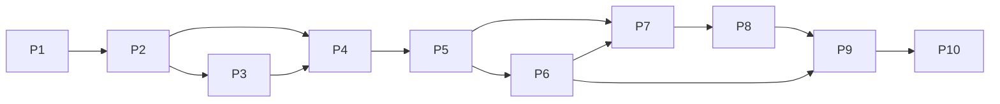

# theNanGuos 规范化实施计划

## 1. 文档职责

本文定义目标系统的建设顺序、阶段依赖、Milestone 和 Work Unit（WU）索引，不记录实时完成度、当前测试数量或执行历史。实际状态和验证证据只见 [STATUS](STATUS.md)，具体任务边界见 [work-units](work-units/)。

## 2. 目标系统与完成定义

目标是本地单用户音乐生成 Web 应用：Vue 前端通过 FastAPI 调用固定 LangGraph，四个 Agent 使用 DeepSeek 生成结构化创作结果，确定性 Tool 构造 Suno 请求；后端轮询、按单次任务设置保存候选 MP3/封面，并提供作品、播放、下载、删除、偏好和只读创作知识。

完整完成需要：

- 数据、Agent、图、Suno、API、Web UI 形成闭环；
- Mock 全栈、浏览器、视觉、安全和真实供应商分别验收；
- 正式文档、实现和测试合同一致；
- 进度使用 WU 和 Milestone 追踪。

## 3. Phase P1–P10

### P1 工程基础与配置

目标：建立 Python/uv、Vue/Vite、FastAPI/CLI 入口、环境变量和本地安全默认值。

产物：`pyproject.toml`、锁文件、前端工程、`.env.example`、模块入口、开发 CORS。

验收门槛：依赖可安装，CLI/API/前端可启动，密钥和运行产物被忽略。

### P2 数据模型与协议合同

目标：定义 TaskPlan、SongSpec、Agent 结果、ScorePlan、Suno、日志、API 视图和知识模型，并在边界严格校验。

产物：Pydantic/dataclass 模型、字段映射、Schema 测试、DATA_MODEL/API_SPEC。

验收门槛：缺失、越界、未知字段、图依赖、模式组合和 HTTPS 等合同可确定性验证。

### P3 用户偏好与创作知识

目标：提供用户主动确认的 JSON 默认值、手工 Markdown 风格偏好，以及维护者整理的风格/乐器/经典曲目知识。

产物：PreferenceStore、Knowledge Schema/Store/Catalog/Retriever、人工样例、原子存储和可重建索引。

验收门槛：合并优先级稳定；单次任务不自动写偏好；非法知识隔离；引用闭合；检索稳定且受预算限制。

### P4 LLM 与 Agent

目标：隔离供应商适配器，使用 DeepSeek Thinking Mode + JSON Output 运行四个职责清楚的结构化 Agent。

产物：LLMClient、DeepSeek adapter、StructuredAgent、四 Agent、职责知识视图。

验收门槛：输出通过 Pydantic；空/截断/非法/校验失败有限重试；reasoning_content 不传播；Agent 不做 I/O。

### P5 LangGraph 编排与本地产物

目标：用固定图把预览、两阶段知识检索、Agent、校验、请求构造和提交/恢复分支组合成单次 GraphState。

产物：GenerateSongGraph、GraphState、GenerationService、四个 JSON 产物。

验收门槛：固定节点顺序、offline 分支、resume 入口、请求间状态隔离和知识降级均有测试。

### P6 Suno、轮询与本地媒体

目标：严格构造 Suno 请求，按离散状态轮询，并安全保存每个候选的 MP3 与封面。

产物：request builder、SunoClient、ArtifactStore、轮询日志、本地媒体路径。

验收门槛：立即首查、总截止时间、全部状态、有限重试、停止事件、HTTPS/公网/无重定向/大小/原子替换通过测试。

### P7 FastAPI 与后台任务

目标：提供预览、创建、查询、停止/继续、作品、Range/下载和偏好接口；浏览器离开后当前进程继续执行。

产物：FastAPI 路由、PreviewStore、TaskRegistry、启动索引和 UI 公开视图。

验收门槛：请求边界、状态码、后台生命周期、服务重启中断标记和媒体定位有 API/浏览器证据。

### P8 Web UI 与播放器

目标：严格依据五页高保真原型实现创作、等待、结果、作品和偏好闭环。

产物：Vue 页面、Router、Pinia、API client、局部/全局播放器、预计进度和错误状态。

验收门槛：正常路径无隐式 demo；用户操作完整；单元、类型、构建和 Mock 全栈 E2E 通过。

### P9 联调、视觉、安全和完整验收

目标：用真实供应商验证合同，完成五页真实数据视觉 QA、错误流程、安全审查和文档一致性。

产物：真实联调证据、视觉对比、最终安全清单、正式文档和状态看板。

验收门槛：真实 DeepSeek/Suno 最小请求分别成功且脱敏；全量自动化检查通过；未完成风险在 STATUS 明确。

### P10 交互与作品管理增强

目标：基于 MVP 实机反馈修正创作/等待布局，提供单次本地候选保留、真实播放进度、候选独立音量、版本选择和整任务删除。

产物：创作与等待页新基线、`retention_limit` 本地合同、`TrackProgress`、版本入口、删除 API/确认交互和 M6 验收证据。

验收门槛：默认保留 1 且不改变供应商生成数量；每个保留候选可独立播放/调音量/下载；整任务删除满足状态与路径安全；1440×1024 视觉、浏览器和文档合同通过。

## 4. Phase 依赖图

Phase 表示逻辑依赖，不代表只能线性提交。一个 WU 必须声明主要 Phase 和依赖 WU。

## 5. Milestone M1–M6

| Milestone | 可验证结果 | 主要 Phase |
|---|---|---|
| M1 本地结构化产物 | CLI `--no-submit` 生成四个 JSON，不访问 Suno | P1–P5 |
| M2 Mock 全栈闭环 | Mock LLM/Suno 完成 Web 创建、等待、播放、下载、停止/继续和偏好 | P1–P8 |
| M3 真实 DeepSeek | Thinking Mode + JSON Output 真实最小生成，隐藏推理不落盘 | P4、P5、P9 |
| M4 真实 Suno | 真实提交/轮询、全部候选媒体保存和本地播放下载 | P6、P7、P9 |
| M5 完整验收 | 五页视觉、错误、安全、文档和全量自动化验收 | P9 |
| M6 交互与作品管理增强 | 创作/等待修正、本地候选保留、版本播放与整任务删除形成完整闭环 | P10 |

Milestone 状态只在 STATUS 记录。

## 6. Work Unit 编号与拆分规则

格式：`WU-<AREA>-<NNN>`。

| 领域码 | 范围 |
|---|---|
| CORE | 工程、配置、公共运行时 |
| DATA | 模型、Schema、字段映射 |
| AGENT | LLM、Agent、prompt |
| KNOW | 偏好、记忆、知识 |
| GRAPH | LangGraph、GraphState、节点 |
| SUNO | Suno、轮询、媒体 |
| API | HTTP、后台任务、生命周期 |
| WEB | 页面、状态管理、播放器 |
| QA | 联调、视觉、安全、验收 |
| DOC | 文档架构与治理 |

一个 WU 只产生一个可独立验收的结果。跨领域任务使用主要产物所属领域，并通过依赖 WU 表达其他领域。WU 定义目标、范围、非范围、依赖、产物、步骤、验证和完成标准，但不保存状态或完成勾选。

## 7. WU 索引

| WU | 主要 Phase | 目标结果 | 依赖 |
|---|---|---|---|
| WU-CORE-001 | P1 | Python/Vue 工程、配置和入口 | 无 |
| WU-DATA-001 | P2 | 核心 Schema 与字段合同 | WU-CORE-001 |
| WU-KNOW-001 | P3 | 偏好、知识 Schema/Store/样例 | WU-DATA-001 |
| WU-AGENT-001 | P4 | DeepSeek 结构化输出和四 Agent | WU-DATA-001 |
| WU-KNOW-002 | P3–P5 | 检索、职责视图、日志和路径安全 | WU-KNOW-001、WU-AGENT-001 |
| WU-GRAPH-001 | P5 | 固定图、GraphState 和离线产物 | WU-AGENT-001、WU-KNOW-002 |
| WU-SUNO-001 | P6 | Suno 请求、轮询和媒体保存 | WU-DATA-001、WU-GRAPH-001 |
| WU-API-001 | P7 | FastAPI、任务注册表和媒体 API | WU-GRAPH-001、WU-SUNO-001 |
| WU-WEB-001 | P8 | 五页 Web UI 和播放器 | WU-API-001 |
| WU-QA-001 | P9 | Mock E2E、视觉、安全和真实联调 | 前述相关 WU |
| [WU-DOC-001](work-units/WU-DOC-001.md) | P1–P9 | 正式文档分层、WU 和状态治理 | 当前代码与旧文档 |
| [WU-WEB-002](work-units/WU-WEB-002.md) | P10 | 创作与等待页按新基线稳定显示和重置 | WU-WEB-001、WU-QA-001 |
| [WU-SUNO-002](work-units/WU-SUNO-002.md) | P10 | 单次任务按设置保留本地候选 | WU-SUNO-001、WU-API-001 |
| [WU-WEB-003](work-units/WU-WEB-003.md) | P10 | 播放进度、候选独立音量和版本入口 | WU-WEB-002、WU-SUNO-002 |
| [WU-API-002](work-units/WU-API-002.md) | P10 | 安全删除整次生成任务 | WU-API-001、WU-WEB-001 |
| [WU-QA-002](work-units/WU-QA-002.md) | P10 | M6 自动化、浏览器、视觉、安全和文档验收 | 前述四个 P10 WU |

只有需要详细交接或后续修改的任务创建独立 WU 文件；索引不为已完成历史制造空洞文档。

## 8. 风险与非目标

- 真实供应商协议可能变化：必须由 API_SPEC、adapter 测试和真实联调共同验证。
- 本地单进程不保证服务重启恢复执行：只能按 taskId 继续远程查询。
- 文件存储不适合多用户/多进程：需求出现前不引入数据库和队列。
- 文档不能替代测试：实现状态必须有代码和新鲜验证证据。
- Kie/Suno 决定实际变体数：`retention_limit` 只控制本地保存，不能降低供应商费用，也不能保证首个候选最符合用户偏好。
- 整任务删除不可恢复：必须二次确认、拒绝运行中任务，并以注册表元数据和 outputs 直属目录约束删除边界。
- 播放进度竖条只表达时间比例，不是音频振幅；不得在 UI 中暗示供应商生成百分比或真实 waveform。
- 本计划不包含登录、多用户、云部署、向量数据库、DAW 或参考音频流程。
