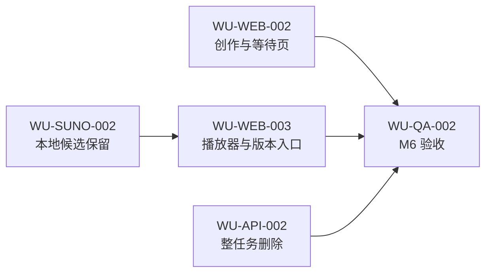

# M6 交互与作品管理增强设计

## 1. 决策状态

本设计于 2026-07-15 经用户确认，定义 MVP 完成后的目标合同。实现状态只见 [STATUS](../STATUS.md)，不得根据本文把 planned 功能描述为已实现。

设计依据包括用户提供的创作页、等待页、结果页和作品页实机截图，以及当前 Vue、FastAPI、TaskRegistry、Kie.ai 轮询和本地 outputs 实现。

## 2. 目标与非目标

目标是修正五页中已观察到的布局和状态问题，使候选播放、版本选择、本地保留数量和整任务删除符合用户预期，并保持本地单用户、文件存储和轮询架构不变。

非目标：

- 不新增第六个作品详情页面；复用现有 `/generations/{request_id}/result`。
- 不把本地保留数量伪装成 Kie/Suno 的实际生成数量。
- 不实现回收站、单候选删除、批量删除或运行中强制删除。
- 不生成真实音频振幅波形，不引入音频分析依赖。
- 不恢复“保存草稿”，不持久化创作输入。

## 3. 当前实现与目标合同

| 范围 | 当前实现 | 目标合同 |
|---|---|---|
| 重新生成方案 | 使用配置滑杆图标 | 使用重试/刷新语义图标 |
| 等待步骤 | active 状态改变网格列，远程步骤使用不同结构 | 所有步骤共用稳定列和对齐规则 |
| 等待页竖条 | 装饰性 `Waveform` | 删除，不暗示音频或真实进度 |
| 结果页竖条 | 固定装饰条，CSS 未按进度逐条填充 | 改为可点击、拖动和键盘操作的播放进度控件 |
| 候选音量 | 所有候选绑定同一 `player.volume` | 按 `audio_id` 保存独立音量 |
| 供应商候选 | 全部下载保存 | 用户选择本地保留 `1 / 2 / 全部`，默认 1 |
| 作品列表 | 快捷操作固定使用第一个候选 | 进入现有结果页选择具体版本播放和下载 |
| 删除作品 | 无接口和入口 | 二次确认后删除整次任务和全部本地文件 |
| 创作输入 | 硬编码示例作为真实值；旧预览可能留在 Pinia | 输入默认为空，示例只作 placeholder，进入新创作时清除旧预览 |
| 输入焦点 | textarea 叠加明显蓝色内框 | 移除内框，保留克制但可见的键盘焦点提示 |

## 4. 已确认产品决策

### 4.1 本地保留数量

Kie.ai 只承诺一个请求返回多个变体，没有公开精确数量参数。本产品新增 `retention_limit`，仅控制本地保存：

- `1`：默认，只保留供应商返回的第一个完整候选；
- `2`：最多保留前两个完整候选；
- `null`：保留全部完整候选，在 UI 表示为“全部”。

该值属于单次任务设置，不进入 `user_profile.json`。后端先完成供应商终态校验，再按响应顺序截取候选，只下载被保留候选的 MP3 和封面。协作日志记录 `provider_candidate_count`、`retention_limit` 和 `retained_candidate_count`，不记录未保留候选的完整 URL。

UI 必须提示：“仅控制本地保存，不会减少供应商实际生成数量或费用。”结果页只显示实际保留数，不使用固定 `2` 作为回退。

### 4.2 版本查看

作品页的一行继续代表一次生成任务，而不是一个候选。标题、封面和“查看 N 个版本”进入现有结果页。作品页可保留首候选快捷试听，但不再提供固定首候选下载；具体播放和下载在结果页选择。

### 4.3 删除整次任务

删除单位为 generation：任务记录、全部保留候选 MP3、封面和 JSON 一并删除，不提供回收站。

- `queued`、`running` 拒绝删除并返回 409；用户必须先停止等待。
- `completed`、`failed`、`stopped`、`interrupted` 可删除。
- stopped/interrupted 的确认文案说明删除后无法继续查询远程任务。
- 删除当前播放任务时，前端先停止并清空全局播放器。
- API 只按注册表中的 request_id 定位 outputs 子目录，禁止客户端传入路径。

## 5. 播放器设计

现有装饰性 `Waveform` 改为语义准确的 `TrackProgress`。它仍可使用竖条视觉，但只表达播放位置，不声称来自音频振幅分析。

数据流：

```text
audio.timeupdate → player.currentTime / player.duration
                 → 当前候选 TrackProgress 填充比例

pointer/keyboard seek → 目标秒数 → audio.currentTime → player.currentTime
```

每个候选音量保存为 `Record<audio_id, number>`；首次播放使用 0.75，切换候选时恢复对应值。结果页和全局播放器操作同一当前候选音量，但不同候选之间不联动。

## 6. 页面设计

### 6.1 创作页

- 重试图标替换配置图标。
- prompt 初值为空，示例放入 placeholder。
- 新进入创作页清除上一轮 preview；不建立跨页面草稿恢复。
- 本地保留数量放在右侧确定性设置中，位于 Suno 模型之后，不放入高级折叠区。
- textarea 本身不绘制蓝色 outline；键盘焦点由外层容器提供轻量提示。

### 6.2 等待页

- 删除进度环下方装饰竖条。
- 本地 Agent 五步和“等待完整歌曲”复用同一行组件与列宽。
- active/done/pending 只能改变颜色、图标和状态文案，不改变网格结构。

### 6.3 结果页

- 每个保留候选拥有播放、播放进度、独立音量和下载。
- 进度条可 seek；非当前候选显示 0 或已保存位置，不伪造进度。
- 标题区域显示实际保留候选数。

### 6.4 作品页

- 标题、封面和“查看 N 个版本”进入现有结果页。
- 删除入口位于每行操作区，打开不可恢复确认对话框。
- 运行中任务不显示可执行删除，或以禁用态说明先停止等待。

## 7. Work Unit 边界



| WU | 单一结果 |
|---|---|
| [WU-WEB-002](../work-units/WU-WEB-002.md) | 创作与等待页按新基线稳定显示和重置 |
| [WU-SUNO-002](../work-units/WU-SUNO-002.md) | 单次任务按用户限制保存本地候选 |
| [WU-WEB-003](../work-units/WU-WEB-003.md) | 候选播放进度、独立音量和版本入口可用 |
| [WU-API-002](../work-units/WU-API-002.md) | 整次任务可安全、不可恢复地删除 |
| [WU-QA-002](../work-units/WU-QA-002.md) | M6 在测试、浏览器、视觉和文档层完成验收 |

## 8. 验收与风险

- 视觉以 1440×1024 实际浏览器截图为准；涉及主要 CTA、字段分组或删除确认文案的进一步变化仍需用户确认。
- 本地保留 1 不能减少 Kie/Suno 调用成本，也不保证第一个变体是用户最喜欢的版本。
- 独立音量是本产品明确选择，不采用多数播放器常见的全局音量语义。
- 删除没有回收站；测试必须证明路径边界、运行中拒绝、失败不从 UI 假装消失。
- 具体实施状态、验证数量和阻塞只写 [STATUS](../STATUS.md)。
