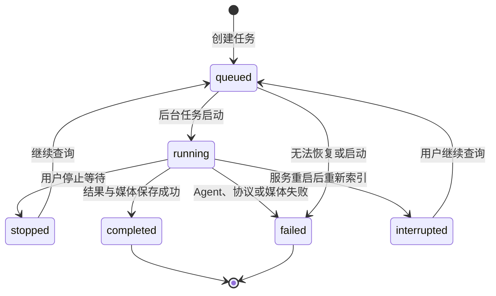

# theNanGuos MVP 功能行为规格

## 1. 文档职责

本文是用户可观察行为的权威规格。字段和枚举见 [数据模型](../architecture/DATA_MODEL.md)，HTTP/供应商协议见 [API 合同](../architecture/API_SPEC.md)，内部 Agent 机制见 [Agent 系统](../architecture/AGENT_SYSTEM.md)。

## 2. 通用行为原则

- 本地单用户、单 FastAPI 进程，不实现认证和多用户隔离。
- 创建接口立即返回任务标识，后台任务在浏览器离开后继续执行。
- 所有用户可见进度必须来自真实业务阶段或明确标注的预计进度。
- 系统不返回 GraphState、隐藏推理、供应商原始 JSON、密钥或 Authorization。
- 产品状态与 Suno 状态分层：产品状态用于 UI；Suno 状态用于轮询和诊断。

## 3. 功能规格

### FR-PREVIEW-001 生成并确认创作预览

**前置条件：** 用户输入非空自然语言；后端可调用 Conductor。

**输入摘要：** 自然语言、语言/纯音乐/人声/模型等本次覆盖参数。

**主流程：** 后端合并偏好，使用原始文本做轻量知识检索，调用 Conductor 生成 `SongSpec` 和 `TaskPlan`，保存进程内预览并返回 `preview_id`。用户可编辑产品允许的 SongSpec 字段。

**状态变化：** 预览创建后有效 30 分钟；成功消费后立即失效。

**异常与恢复：** 空输入返回校验错误；模型输出空、截断、非法 JSON 或校验失败最多重试两次；预览不存在、过期或重复消费时创建生成返回冲突，前端保留输入并提示重新预览。

**输出摘要：** `preview_id`、结构化创作方案和解释性计划，不返回 prompt 或隐藏推理。

**验收场景：** 用户能看到真实系统理解、修改方案并确认；正式生成不重复调用 Conductor。

**相关合同：** [API-PREVIEW-001](../architecture/API_SPEC.md#api-preview-001)、[DM-GenerationPreview](../architecture/DATA_MODEL.md#dm-generationpreview)。

### FR-GEN-001 创建歌曲生成任务

**前置条件：** Web 请求持有有效预览；CLI 请求具有有效自然语言。

**输入摘要：** 已确认 SongSpec、preview_id、本次高级参数、`retention_limit: 1 | 2 | null` 和默认值保存选择；默认 1，null 表示全部。

**主流程：** Web 一次性消费预览，创建 `GenerationRecord` 和后台任务，立即返回 `request_id`；CLI 直接进入同一生成服务。正式图复用确认后的 SongSpec/TaskPlan。

**状态变化：** `queued → running`，失败时进入 `failed`，完成时进入 `completed`。

**异常与恢复：** 预览冲突不创建任务；后台异常转为结构化错误并持久化协作日志。

**输出摘要：** 创建响应只包含 request_id 和初始 UI 状态。

**验收场景：** 请求无需等待歌曲完成；离开页面不取消当前服务器进程中的任务。

**相关合同：** [API-GEN-001](../architecture/API_SPEC.md#api-gen-001)、[DM-GenerationRecord](../architecture/DATA_MODEL.md#dm-generationrecord)。

### FR-AGENT-001 执行四 Agent 创作阶段

**前置条件：** 已有确认 SongSpec 和 TaskPlan。

**输入摘要：** 用户请求、偏好、知识快照和上游结构化结果。

**主流程：** 结构化检索后依次执行 Lyrics、MusicPlanner、Arrangement，形成 ScorePlan；每个 Agent 只接收职责所需视图。

**状态变化：** 用户可见阶段依次为 `lyrics`、`music_planner`、`arrangement`、请求构造。

**异常与恢复：** LLM 结构失败按统一策略重试；知识检索或角色视图失败降级，不阻断基础生成；Agent 失败终止当前任务。

**输出摘要：** SongSpec、ScorePlan、SunoRequest 和脱敏协作日志。

**验收场景：** Lyrics 不取得经典曲目分析；Suno builder 不访问知识库；Agent 不写文件或调用 Suno。

**相关合同：** [Agent 系统](../architecture/AGENT_SYSTEM.md)、[DM-GraphState](../architecture/DATA_MODEL.md#dm-graphstate)。

### FR-POLL-001 轮询 Suno 状态

**前置条件：** Suno 提交成功并返回 taskId。

**输入摘要：** taskId、轮询间隔、总等待时间和停止事件。

**主流程：** 取得 taskId 后立即首次查询；`PENDING`、`TEXT_SUCCESS`、`FIRST_SUCCESS` 继续；默认等待 30 秒后再次查询；`SUCCESS` 先解析和校验全部候选，再按供应商响应顺序应用本地 `retention_limit`。

**状态变化：** Suno 状态写入脱敏日志；UI 预计进度区间分别为 55–64、65–79、80–94、100。

**异常与恢复：** 四种业务失败终态、未知状态和空结果立即失败；连接错误、429、5xx 只在单一总截止时间内有限重试；认证和参数错误不重试。

**输出摘要：** 被保留候选的音频元数据、供应商候选数、保留上限、实际保留数、最终状态、尝试数和耗时；未保留候选 URL 不落日志。

**验收场景：** 首次查询不等待；总超时严格生效；`FIRST_SUCCESS` 显示“第一首已完成，等待全部结果”。

**相关合同：** [API-SUNO-POLL-001](../architecture/API_SPEC.md#api-suno-poll-001)、[DM-SunoTaskDetails](../architecture/DATA_MODEL.md#dm-sunotaskdetails)。

### FR-WAIT-001 停止等待与继续查询

**前置条件：** 任务已提交 Suno 且尚未得到最终结果。

**输入摘要：** request_id。

**主流程：** 停止等待设置本地停止事件并保存 taskId；继续查询重置事件并以 resume 模式启动轮询，不重新调用 Agent 或提交 Suno。

**状态变化：** `running → stopped`；继续时 `stopped/interrupted → queued → running`。

**异常与恢复：** 没有 taskId、任务已完成或本地日志缺失时拒绝继续并返回可操作错误。

**输出摘要：** 更新后的公开任务状态。

**验收场景：** UI 明确远程生成可能继续；从作品页继续查询后可得到最终作品。

**相关合同：** [API-WAIT-001](../architecture/API_SPEC.md#api-wait-001)。

### FR-RESULT-001 展示、播放和下载候选歌曲

**前置条件：** Suno 成功且候选媒体已保存到本地。

**输入摘要：** request_id、audio_id 和播放/下载操作。

**主流程：** 结果页展示全部已保留候选、封面、标题、时长、标签和模型；时间滑块按 `currentTime / duration` 更新并支持 seek；候选音量按 audio_id 独立保存；下载逐首设置安全文件名。

**状态变化：** 媒体保存完成后任务进度变为 100、状态 completed。

**异常与恢复：** 本地文件不存在返回 404，不回退到未经校验的供应商 URL；部分保存失败显示结构化错误。

**输出摘要：** 支持 HTTP Range 的音频、封面和 Content-Disposition 下载响应。

**验收场景：** 所有已保留候选可独立播放、seek、调音量和下载，页面不把封面描述成 DeepSeek 生图。

**相关合同：** [API-MEDIA-001](../architecture/API_SPEC.md#api-media-001)、[本地作品视图](../architecture/DATA_MODEL.md#本地作品视图)。

### FR-WORK-001 索引和筛选本地作品

**前置条件：** outputs 下存在协作日志或当前进程有任务。

**输入摘要：** 搜索词、状态筛选和时间排序。

**主流程：** 服务启动和列表查询从脱敏协作日志重建作品视图；前端显示已完成、生成中、已停止、失败和服务中断。

**状态变化：** 列表读取不修改任务；继续查询另走 FR-WAIT-001。

**异常与恢复：** 单个损坏日志被跳过；空列表显示真实空态；demo 只允许显式开关。

**输出摘要：** UI 任务摘要和候选本地媒体链接。

**验收场景：** 搜索、筛选、排序可用；标题、封面和“查看 N 个版本”进入既有结果页；全局播放器使用本地接口。

### FR-WORK-DELETE-001 删除整次生成任务

**前置条件：** request_id 已登记，任务处于 completed、failed、stopped 或 interrupted；queued/running 必须返回冲突。

**主流程：** 用户在作品页触发删除，二次确认后后端只按注册表元数据定位 outputs 直属任务目录；文件删除成功后才移除注册表记录。删除当前播放任务后清空全局播放器。

**异常与恢复：** 不存在返回 404；运行中返回 409；文件占用或删除失败返回安全错误并保留记录。拒绝根目录、越界路径、符号链接和客户端提供的文件路径。stopped/interrupted 对话框说明删除后不能继续查询远程任务。

**输出摘要：** 成功 204，无回收站、撤销、单候选删除或远程 Suno 删除。

**验收场景：** 整个任务目录和作品记录一起消失；失败时不出现幽灵删除；删除路径边界有确定性测试。

**相关合同：** [API-GEN-DELETE-001](../architecture/API_SPEC.md#api-gen-delete-001)。

**相关合同：** [API-GEN-LIST-001](../architecture/API_SPEC.md#api-gen-list-001)。

### FR-PREF-001 保存和清除确认型偏好

**前置条件：** 本地用户主动操作偏好页或结果页确认保存。

**输入摘要：** 语言、纯音乐、人声、模型和用户编辑的 Markdown。

**主流程：** 默认字段以 JSON 原子写入；风格说明以 Markdown 原子写入；读取时返回当前值。

**状态变化：** 只改变后续请求的默认上下文，不修改已生成作品或正在运行的 GraphState。

**异常与恢复：** 非法枚举拒绝；Markdown 预览不得执行原始 HTML/事件处理器；清除前二次确认。

**输出摘要：** 当前默认值和风格文本。

**验收场景：** 单次生成不自动更新偏好；清除偏好不删除作品；标题和歌词不被保存。

**相关合同：** [API-PREF-001](../architecture/API_SPEC.md#api-pref-001)、[用户偏好模型](../architecture/DATA_MODEL.md#用户偏好模型)。

### FR-KNOW-001 使用只读创作知识

**前置条件：** knowledge 目录可用；条目通过 YAML 和引用校验。

**输入摘要：** 原始用户文本和结构化 SongSpec。

**主流程：** 请求开始加载一次目录快照；Conductor 前做术语检索，SongSpec 后做结构化检索；Retriever 按 Agent 生成职责视图。

**状态变化：** KnowledgeContext 只存在本次 GraphState；可重建 Catalog 缓存在源变化后刷新。

**异常与恢复：** 非法条目隔离并产生通用警告；符号链接和越界路径拒绝；整体失败时 `knowledge.used=false` 且歌曲继续。

**输出摘要：** Agent 内部摘要和协作日志中的 ID、类型、分数、相对路径、索引时间与警告。

**验收场景：** 日志不保存 excerpt/正文/绝对路径；角色隔离和稳定排序有测试。

**相关合同：** [知识机制](../architecture/AGENT_SYSTEM.md#创作知识库)、[知识模型](../architecture/DATA_MODEL.md#知识模型)。

### FR-CLI-001 CLI 离线与提交模式

**前置条件：** Python 环境可运行；提交模式配置供应商凭据。

**输入摘要：** 自然语言和 CLI 参数。

**主流程：** CLI 直接调用 Conductor 和同一 GenerationService；`--no-submit` 在请求构造后结束，提交模式继续 Suno。

**状态变化：** 离线模式完成后状态 offline_complete；不创建 Web 预览。

**异常与恢复：** 缺少提交凭据时给出配置错误；离线模式不得访问 Suno。

**输出摘要：** 四个 JSON 产物；提交模式另含本地媒体。

**验收场景：** CLI 不绕过 Schema、Agent、Tool 和日志合同。

**相关合同：** [CLI 与运行时](../architecture/ARCHITECTURE.md#入口与进程模型)。

### FR-RESTART-001 服务重启后标记中断任务

**前置条件：** 服务启动时 outputs 中存在已提交但非最终状态的协作日志。

**输入摘要：** 本地 collaboration_log 和已保存 taskId。

**主流程：** TaskRegistry 重建只读记录；成功任务标 completed，停止任务标 stopped，仍在远程进行的任务标 interrupted/service_restarted。

**状态变化：** 不恢复原 asyncio.Task 或 GraphState；用户触发继续查询后创建新的本地轮询任务。

**异常与恢复：** 损坏日志跳过；无 taskId 的中断任务不能继续远程查询。

**输出摘要：** 作品页可理解的中断状态和继续查询入口。

**验收场景：** 服务不把重启后的遗留任务伪装成正在执行；继续查询不重复提交 Suno。

**相关合同：** [TaskRegistry 架构](../architecture/ARCHITECTURE.md#后台任务与生命周期)。

## 4. 任务状态机

| 产品状态 | 含义 | 可恢复动作 |
|---|---|---|
| queued | 已登记，等待后台执行 | 自动开始 |
| running | Agent、提交、轮询或保存正在进行 | 可停止等待 |
| stopped | 本地轮询已停止，远程可能继续 | 继续查询 |
| interrupted | 服务重启后未恢复原执行 | 有 taskId 时继续查询 |
| completed | 本地候选已保存 | 播放、下载 |
| failed | 当前任务终止 | 查看错误、重新创作 |

## 5. 跨功能安全与验收

- 路径必须由 request_id/audio_id 元数据定位，拒绝路径遍历。
- 媒体下载限制 HTTPS、公网地址、来源白名单、大小和超时，不跟随重定向。
- Markdown 预览按文本/受控 Markdown 渲染，不执行用户 HTML。
- 协作日志只保存脱敏 URL、本地相对路径和知识引用。
- Mock 单元/API/E2E 与真实供应商联调分别记账，不能互相替代。
