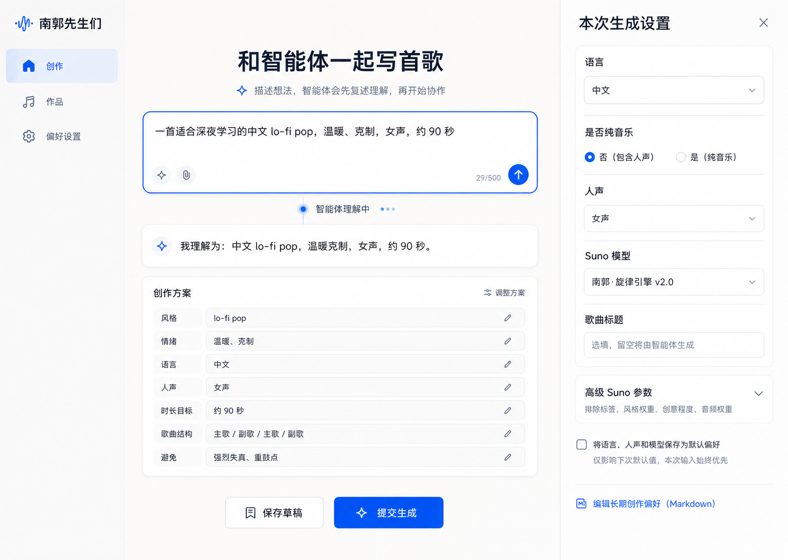
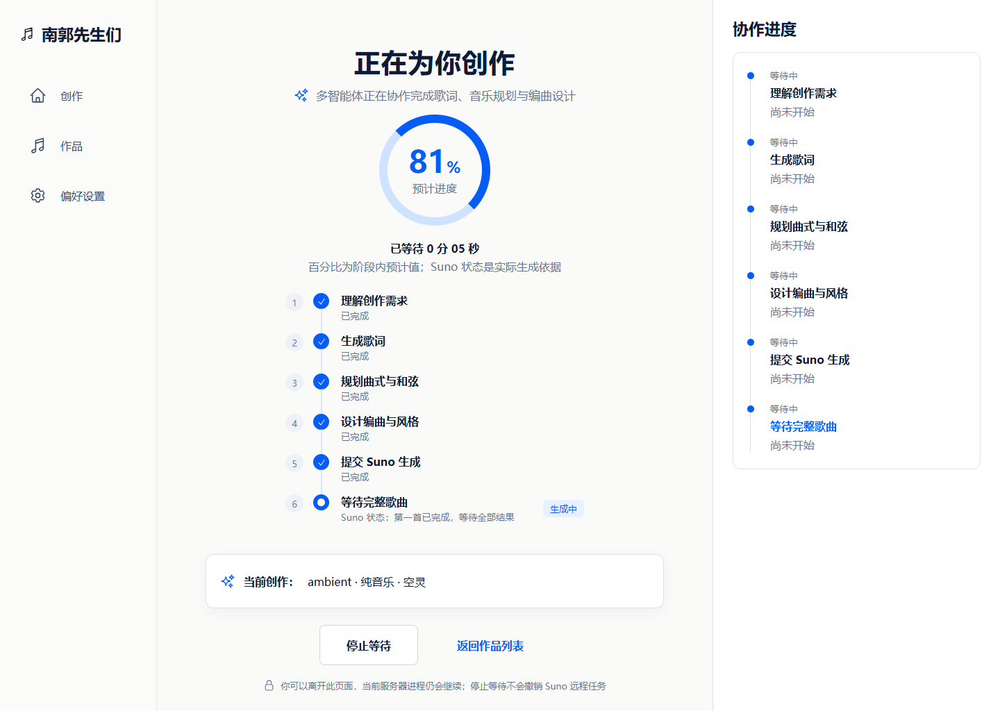
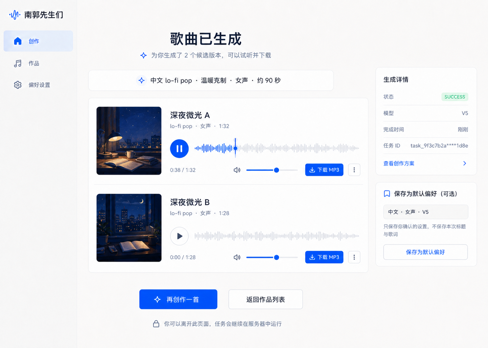
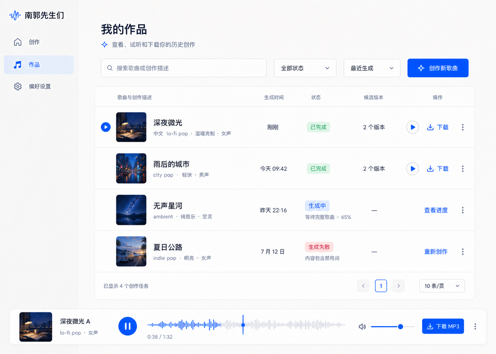
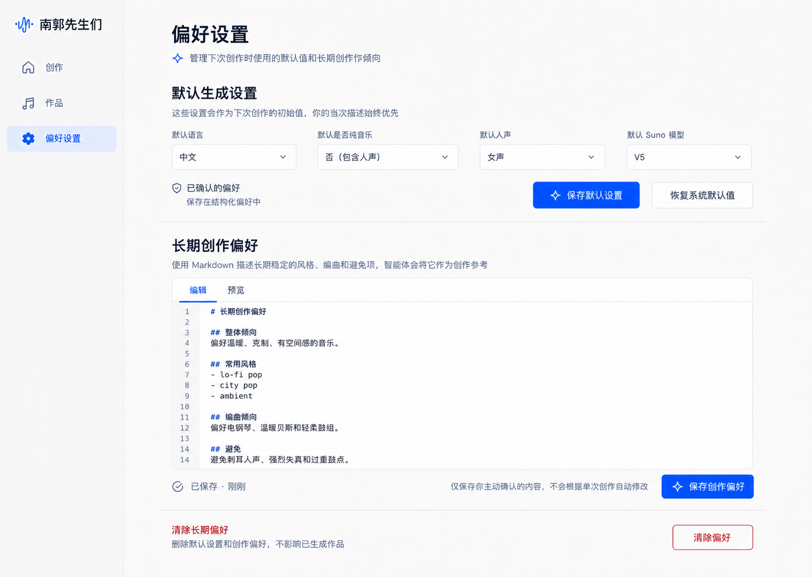

# theNanGuos Web UI 设计规格

## 1. 设计基线

MVP 是面向电脑浏览器的 Web 应用，不是 Electron、Tauri 或 Python 原生桌面应用。默认验收视口为 1440×1024，使用浅色石灰背景、深色正文和钴蓝强调色。

已确认高保真原型是视觉和交互基线。导航、字段分组、页面状态、主要 CTA 或整体视觉语言发生实质变化前，必须说明原因、影响和替代方案并取得用户确认。

## 2. 原型索引

### 创作页



自然语言是主入口。输入初始为空，示例只作为 placeholder；进入新的创作页会清除上一轮临时 preview，不恢复草稿。系统先返回真实 Conductor 预览，再展示可编辑方案；右侧只放本次确定性设置，高级 Suno 参数默认折叠。正式主 CTA 使用“两阶段确认”：先生成创作方案，再由用户点击“确认方案并生成”；MVP 不提供保存草稿。“重新生成方案”使用重试语义图标。

### 等待生成页



展示可理解的业务阶段，不暴露思维链、prompt 或原始 JSON。`FIRST_SUCCESS` 表示第一首完成但仍等待全部结果。“离开页面任务继续”只指当前后端进程，不代表 LangGraph 跨进程恢复。

Suno 只有离散状态。预计进度区间为：`PENDING` 55–64%、`TEXT_SUCCESS` 65–79%、`FIRST_SUCCESS` 80–94%、`SUCCESS` 100%。阶段内每 5 秒最多增加 1%，不得越过区间上限；状态文字始终是实际依据。预计进度下方不显示装饰性音频竖条；本地五步与“等待完整歌曲”始终使用相同的编号、图标和文本列。

### 生成结果页



同一任务展示全部已保留候选，支持在线播放、真实时间进度拖动、候选独立音量和逐首下载。时间滑块只表达播放位置，不伪装成音频振幅。封面使用 Suno `imageUrl` 下载后的本地文件，不调用额外生图模型。保存默认偏好不包含标题和歌词。候选卡不展示没有已定义行为的“更多”菜单。

### 作品页



展示已完成、生成中、已停止等待、失败和服务中断任务，支持搜索、筛选、排序、首候选快捷播放、进入结果页选择版本、查看进度、继续查询和整任务删除。作品页不固定下载首候选；具体版本在结果页下载。正常产品路径不得用演示数据或默认封面掩盖真实空态。

### 偏好设置页



“默认生成设置”对应确认型 JSON；“长期创作偏好”对应用户编辑的 Markdown。Markdown 预览不执行原始 HTML。清除偏好需要二次确认且不删除作品。

## 3. 导航与主流程

左侧导航固定为“创作 / 作品 / 偏好设置”。不提供“智能体”“灵感”“风格”独立导航：Agent 属于内部机制，风格属于创作方案、偏好和知识上下文。

```text
创作输入 → 方案预览与确认 → 提交 → 等待/轮询 → 结果播放与下载
                                      └→ 作品页持续查看或继续查询
```

## 4. 参数分层

1. 自然语言：主题、风格、情绪、场景和时长目标。
2. 创作方案：标题、风格、情绪、语言、人声、时长、结构和避免项。
3. 本次设置：语言、是否纯音乐、人声、Suno 模型、本地保留 1/2/全部和标题覆盖；默认保留 1，提示不会减少供应商生成数量或费用。
4. 高级 Suno 参数：negativeTags 和三个权重，默认折叠。
5. 内部参数：customMode、callback URL、API key、轮询间隔和超时不展示。

字段含义和枚举见 [数据模型](../architecture/DATA_MODEL.md)，请求与错误见 [API 合同](../architecture/API_SPEC.md)。

## 5. 页面交互合同

### 5.1 创作页

- 提交描述后显示加载状态，成功后显示真实 SongSpec；失败保留输入。
- 用户确认方案前不创建正式任务。
- 正式任务只通过“确认方案并生成”创建；不提供保存草稿入口。
- 输入框不显示蓝色内层 outline，键盘焦点由输入容器的轻量外层提示表达。
- 允许编辑产品字段，不允许编辑 TaskPlan、GraphState 或供应商 JSON。
- 可选择本次明确字段是否保存为默认值。

### 5.2 等待页

- 展示真实 user_request、阶段事件和记录时间。
- 停止等待按钮说明远程任务可能继续。
- 已停止或中断状态提供返回作品页；继续查询在作品页触发。
- demo 数据只在 URL 显式 `?demo=1` 时启用。
- active、done、pending 只改变图标、颜色和状态文案，不改变步骤行的网格结构。

### 5.3 结果页

- 展示真实候选标题、标签、模型和创建时间。
- 播放器使用本地音频 URL；下载使用逐首链接。
- 播放进度控件使用真实 currentTime/duration，支持指针和键盘 seek；每个 audio_id 默认音量 0.75 并独立保存。
- 候选只显示已实现的播放和下载操作，不保留无行为“更多”入口。
- 主动保存偏好时使用本任务实际设置。

### 5.4 作品页

- 列表只使用服务端返回的数据和封面。
- 没有实现行为的按钮不得出现。
- 全局播放器在页面切换后保留当前本地候选。
- 标题、封面和“查看 N 个版本”进入 `/generations/{request_id}/result`；N 使用实际已保留候选数。
- completed、failed、stopped、interrupted 显示删除入口；确认弹窗说明不可恢复，stopped/interrupted 额外提示失去继续查询能力；运行中不显示删除入口。

### 5.5 偏好设置页

- JSON 默认值和 Markdown 分开保存。
- 保存、清除有明确成功/失败反馈。
- 清除操作由对话框二次确认。

## 6. 可访问性与错误表达

- 等待、失败、停止和中断不能只依靠颜色区分。
- 所有表单控件有可访问名称；主要操作支持键盘焦点。
- 播放、暂停、音量和下载有明确文本或 aria-label。
- 错误信息说明用户可执行的下一步，不显示内部堆栈和供应商敏感信息。

## 7. 前端验收

- 在 1440×1024 将五页实现截图与对应 PNG 对照。
- 自然语言、方案编辑、折叠参数、提交、停止、继续、搜索/筛选、播放、下载、偏好保存/清除和 Markdown 编辑/预览可用。
- 单元测试覆盖参数映射、预计进度、状态归一化、播放器和错误提示。
- Chromium E2E 覆盖主生成、停止后继续查询、服务重启后继续查询、保存/清除偏好且作品不删除。
- 真实供应商视觉 QA 与 Mock E2E 分开记录在 [开发状态](../planning/STATUS.md)。
